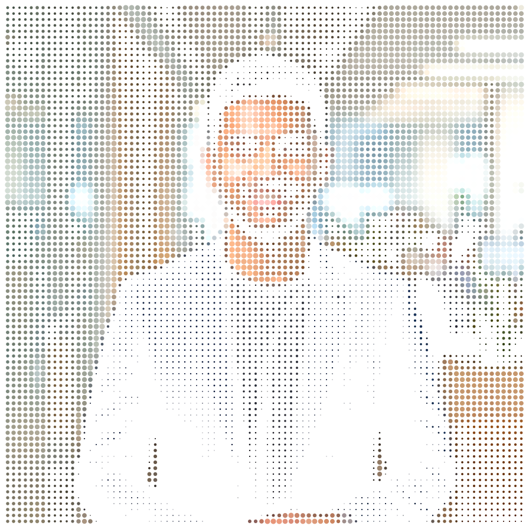
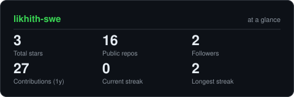
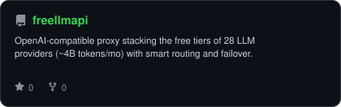
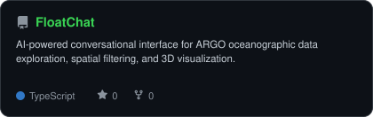
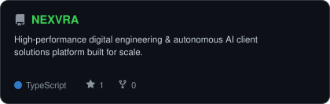
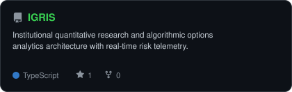

<div align="center">

<!-- PORTRAIT - generated by scripts/dotify.py from assets/me.jpg.
     Colour mode, so one file serves both GitHub themes. Regenerate with:
       python scripts/dotify.py assets/me.jpg -o assets/portrait \
         --cols 88 --equalize --detail 0.5 --color -->


<br>

<!-- NAME / TAGLINE - animated typing -->
<a href="https://github.com/likhith-swe">
  
</a>

<br>

<!-- SOCIALS -->
<a href="https://linkedin.com/in/likhith-swe"></a>
<a href="mailto:slikith660@gmail.com"></a>
<a href="https://nexvra.in"></a>
<a href="https://leetcode.com/u/LikhithS046"></a>
<a href="https://hackerrank.com/profile/slikhithBTECH24"></a>


</div>

---

## `~/` whoami

```console
$ cat about.txt
```

Hi, I'm **Likhith S**. Full-Stack & AI Engineer focused on building high-throughput LLM proxies, autonomous multi-agent pipelines, and real-time interactive web applications.

- Currently building **[FreeLLM-API](https://github.com/likhith-swe/freellmapi)** & **[NEXVRA](https://nexvra.in)**
- Portfolio: **[nexvra.in](https://nexvra.in)**
- Exploring **Distributed AI Systems, LLM Orchestration & Low-Latency Backends**
- Fun fact: **I turn complex architectural bottlenecks into automated background workers.**

<br>

<div align="center">

## `~/` toolbox


</div>

---

<div align="center">

## `~/` skill radar

<table>
<tr>
<td width="50%" align="center" valign="middle">

<!-- Self-rated radar - edit assets/skills.json, the workflow redraws it -->
<picture>
  <source media="(prefers-color-scheme: dark)"  srcset="assets/radar-dark.svg">
  <source media="(prefers-color-scheme: light)" srcset="assets/radar-light.svg">
  
</picture>

</td>
<td width="50%" align="center" valign="middle">

<!-- Live radar built from real language byte counts across your repos -->
<picture>
  <source media="(prefers-color-scheme: dark)"  srcset="assets/radar-langs-dark.svg">
  <source media="(prefers-color-scheme: light)" srcset="assets/radar-langs-light.svg">
  
</picture>

</td>
</tr>
</table>

</div>

---

<div align="center">

## `~/` contribution calendar

<!-- 3D isometric calendar, regenerated every 6h by .github/workflows/metrics.yml -->


<br><br>

<!-- Snake eats the contribution graph - .github/workflows/snake.yml -->
<picture>
  <source media="(prefers-color-scheme: dark)"  srcset="https://raw.githubusercontent.com/likhith-swe/likhith-swe/output/snake-dark.svg">
  <source media="(prefers-color-scheme: light)" srcset="https://raw.githubusercontent.com/likhith-swe/likhith-swe/output/snake.svg">
  
</picture>

</div>

---

<div align="center">

## `~/` the numbers

<!-- Generated by scripts/cards.py into this repo. Deliberately NOT
     github-readme-stats / streak-stats / github-profile-trophy: those are
     shared public instances that go down and take the whole section with them. -->
<picture>
  <source media="(prefers-color-scheme: dark)"  srcset="assets/card-stats-dark.svg">
  <source media="(prefers-color-scheme: light)" srcset="assets/card-stats-light.svg">
  
</picture>

<br>


<br><br>


</div>

---

<div align="center">

## `~/` selected work

<!-- Cards generated by scripts/cards.py from assets/projects.json.
     Stars, forks and language are pulled live from the API on every run. -->
<table>
<tr>
<td width="50%">
  <a href="https://github.com/likhith-swe/freellmapi">
    <picture>
      <source media="(prefers-color-scheme: dark)"  srcset="assets/card-freellmapi-dark.svg">
      <source media="(prefers-color-scheme: light)" srcset="assets/card-freellmapi-light.svg">
      
    </picture>
  </a>
</td>
<td width="50%">
  <a href="https://github.com/likhith-swe/FloatChat">
    <picture>
      <source media="(prefers-color-scheme: dark)"  srcset="assets/card-FloatChat-dark.svg">
      <source media="(prefers-color-scheme: light)" srcset="assets/card-FloatChat-light.svg">
      
    </picture>
  </a>
</td>
</tr>
<tr>
<td width="50%">
  <a href="https://github.com/likhith-swe/NEXVRA">
    <picture>
      <source media="(prefers-color-scheme: dark)"  srcset="assets/card-NEXVRA-dark.svg">
      <source media="(prefers-color-scheme: light)" srcset="assets/card-NEXVRA-light.svg">
      
    </picture>
  </a>
</td>
<td width="50%">
  <a href="https://github.com/likhith-swe/IGRIS">
    <picture>
      <source media="(prefers-color-scheme: dark)"  srcset="assets/card-IGRIS-dark.svg">
      <source media="(prefers-color-scheme: light)" srcset="assets/card-IGRIS-light.svg">
      
    </picture>
  </a>
</td>
</tr>
</table>

<sub>

| project | live / repo | stack |
|---|---|---|
| **[FreeLLM-API](https://github.com/likhith-swe/freellmapi)** | [github.com/likhith-swe/freellmapi](https://github.com/likhith-swe/freellmapi) | `Python` `FastAPI` `AsyncIO` `OpenAI SDK` |
| **[FloatChat](https://github.com/likhith-swe/FloatChat)** | [github.com/likhith-swe/FloatChat](https://github.com/likhith-swe/FloatChat) | `TypeScript` `React` `Tailwind CSS` `AI/LLM` |
| **[NEXVRA](https://github.com/likhith-swe/NEXVRA)** | [nexvra.in](https://nexvra.in) | `Next.js` `TypeScript` `Tailwind CSS` |
| **[IGRIS](https://github.com/likhith-swe/IGRIS)** | [github.com/likhith-swe/IGRIS](https://github.com/likhith-swe/IGRIS) | `TypeScript` `Next.js` `Tailwind CSS` `Quantitative Analytics` |

</sub>

</div>

---

<div align="center">

<sub>`01110100 01101000 01100001 01101110 01101011 01110011 00100000 01100110 01101111 01110010 00100000 01110011 01100011 01100010 01101111 01101100 01101100 01101001 01101110 01100111`</sub>

</div>
